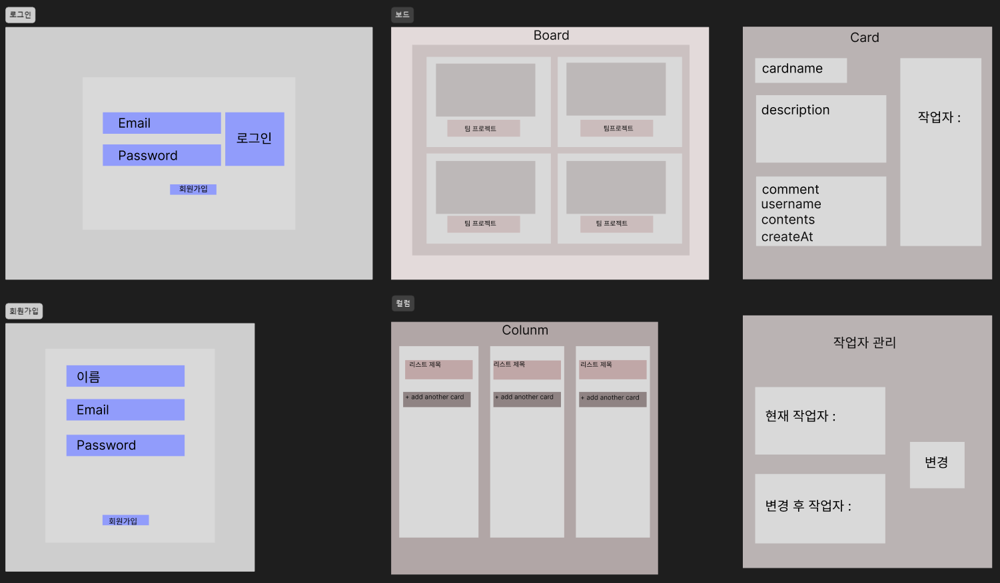
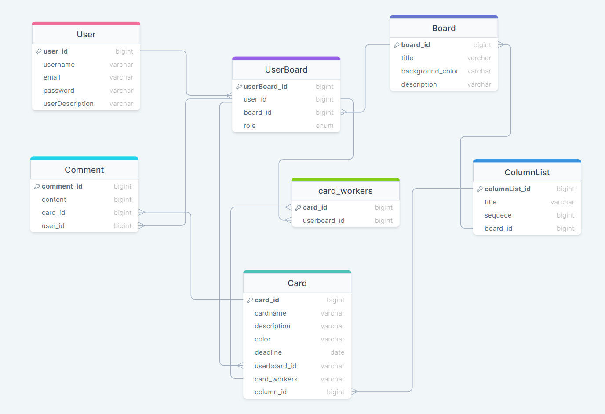

# ProjceTitle: Trello
프로젝트 기간: 3월 18일~3월 25일  
- 한 줄 요약 : 작업 계획, 추적 및 수행할 수 있는 유연한 작업 관리 도구로 프로젝트 관리, 작업 구성, 협업을 구축할 수 있는 기능을 제공하는 협업 툴입니다.
## **개발환경** 

## **멤버구성**
[주준호](https://github.com/JooJuneHo) **[팀장]** 
[최병은](https://github.com/beunchoi) 
[황세연](https://github.com/gorockgorock) 
[최지원](https://github.com/jiwon317) 
[공완희](https://github.com/karine0908) 

## **구현기능**
- [x] 사용자 관리 기능
- [x] 보드 관리 기능
- [x] 컬럼 관리 기능
- [x] 카드 관리 기능
- [x] 카드 상세 기능
- [x] 쿼리 최적화, 인덱싱

## **와이어 프레임**

## **ERD diagram**
